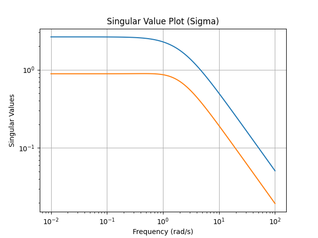

# ControlX

ControlX is a comprehensive Python library and simulation environment for advanced multivariable control systems, designed to cover the syllabus of **EL2520 Control Theory and Practice, Advanced Course**.

This project demonstrates the analysis and design of complex control problems, including MIMO systems, robust control, optimal control (LQG), and Model Predictive Control (MPC).

## Features & Syllabus Mapping

This project implements core concepts from the EL2520 course syllabus:

| Syllabus Topic | Implementation File | Functionality |
|---|---|---|
| **Control of systems with multiple inputs and outputs** | `src/analysis.py`, `demo.py` | `calculate_poles`, `calculate_zeros`, MIMO system definition in demo. |
| **Analysis and modelling of systems and signals** | `src/analysis.py` | `calculate_singular_values` (Sigma plot), `system_gain`. |
| **Fundamental limitations for control performance** | `src/analysis.py` | Poles/Zeros analysis (RHP zeros limitation). |
| **Sensitivity and robustness in feedback systems** | `src/robustness.py` | `sensitivity_function`, `complementary_sensitivity_function`, `robust_stability_margin`. |
| **Analysis of stability with the Small Gain Theorem** | `src/robustness.py` | `small_gain_theorem_check`. |
| **Modelling of uncertainty and analysis of robust stability** | `src/robustness.py` | `calculate_hinf_norm` (H-infinity norm). |
| **Analysis of interactions (RGA)** | `src/analysis.py` | `relative_gain_array` (RGA). |
| **Synthesis of controllers through optimization (LQG)** | `src/synthesis.py` | `design_lqg`, `design_lqr`, `design_kalman_filter`. |
| **Predictive control with constraints (MPC)** | `src/mpc.py` | `MPCController` class using `cvxpy`. |

## Project Structure

```
ControlX/
├── src/                # Core library source code
│   ├── analysis.py     # MIMO Analysis (Poles, Zeros, SVD, RGA)
│   ├── robustness.py   # Robustness & Sensitivity (H-inf, Small Gain)
│   ├── synthesis.py    # Controller Synthesis (LQR, LQG)
│   └── mpc.py          # Model Predictive Control (MPC)
├── tests/              # Unit tests
├── images/             # Generated plots and artifacts
├── demo.py             # E2E demonstration script
├── requirements.txt    # Python dependencies
└── LICENSE             # MIT License
```

## Installation

1. Clone the repository.
2. Install dependencies:
   ```bash
   pip install -r requirements.txt
   ```

## Usage

### Run the Demo

The `demo.py` script runs a complete end-to-end simulation of a MIMO system, performing analysis, designing LQG and MPC controllers, and generating plots.

```bash
python3 demo.py
```

This will generate the following artifacts in `images/`:

### Analysis Artifacts

#### Singular Value Plot (Sigma)
Shows the system gain over frequency (Principal Gains).


#### Sensitivity Function
Shows the peak sensitivity, indicating robustness margins.


### Control Performance

#### LQG Step Response
Closed-loop step response using Linear Quadratic Gaussian control.


#### MPC Simulation
Simulation of Model Predictive Control with input/state constraints.


## Running Tests

Unit tests verify the correctness of the implementation.

```bash
pytest tests/
```

## License

MIT License. See `LICENSE` for details.
